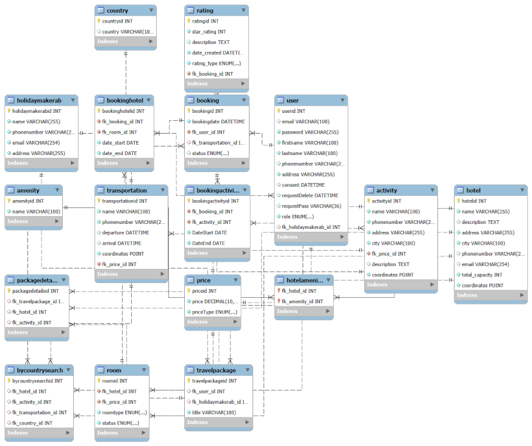

# HolidayMaker
A simple backend travel API written in C# using ASP.NET Core running on .NET 10 featuring session based authentication and MySQL data storage. The API manages users,  accommodation, activity and transportation bookings bundled together as travel packages.

## Technology stack
- C#
- ASP.NET Core
- .NET 10
- MySQL
- Postman (testing)
- MySQL access via MySqlHelper
- Session-based authentication

## Requirements
### **System Requirements**

- .NET SDK 10
- Git
- A REST client (Ex. Bruno, Postman or Thunderclient)
- Local MySQL server version 9.2.0
- Configured connection string

### **Functional Requirements**

- [X] Login authorization (User account)
- [ ] Search for vacant accommodations with specified criteria such as vacancy, location and party size
- [ ] Filter by hotel capacity
- [X] Create and manage bookings with one or more rooms
- [ ] Filter accommodations by amenities
- [ ] Complex filtering of accommodations by distance to attractions
- [ ] Search results include nearby alternatives in descending, prioritized order
- [X] Role specific account and system management
- [ ] Search with specific departure and arrival time
- [X] Clear descriptions of the accommodation and travel package options so the traveler understands their selection prior to booking
- [X] Traveler can view lists with concise descriptions
- [X] Display for traveler detailed information of a selected booking
- [ ] Display itemized cost breakdown for the traveler
- As an admin:
  - [ ] View lists of bookings, travelers, accommodations and activities with concise descriptions
  - [ ] View detailed descriptions of bookings, accommodations, activities and users

### Suggested Additional features

- [ ] Recommendations based on previous bookings, intersets and travel history
- [X] Rating of destinations and accommodations by previous guests
- [ ] Ability for user to send messages to accommodations, activty managers or tour operators
- As Admin:
  - [ ] Cancel or change reservations
  - [ ] Plan a list of excursions for a specified trip
- [ ] Traveler can sign up for single, multiple or all stops on an excursion
- [ ] Seat reservation for limited places such as excursions
- [ ] Detailed cost invoice

## :rocket How to Run

```
git clone git@github.com:hkmp1303/HolidayMaker.git

cd HolidayMaker

dotnet run
```


## Configuration

Configure the database connection string in Program.cs before running the application which uses MySQL and expects the required schema to be present. The local HTTP port used during development is defined in Properties/launchSettings.json. Configuration values are loaded at runtime. Sessions are stored in memory.

## Database Design
### EER Diagram


The initial database design was created early in the project. Structural issues were identified such as a lack of convergence between transportation, activity, hotel and package bookings as well as certain tables implementing specific features without required relationships to relevant tables. A revised, proposed EER diagram was created and reviewed by group members which improved entity relationships and normalization.

Due to time constraints, the proposed changes were not fully implemnted before delivery. The design improvments were discussed with the team on Tuesday December 16th. The proposed diagram is available in `docs/agile/diagrams/proposed_diagram` along with diagram versions 1 and 2.

### Database Setup
While in MySQLWorkbench, open the data.ddl from the project folder. If it is not visible, select "View all file types". Run the SQL scripts in data.ddl to create the database, the user and tables. Then the SQL scripts in the data.sql file to populate the tables with mock data. The data can also be populated through Postman by reseting the database through delete /db once the API is running.

## API Overview

The API will be available via HTTP protocal at `http://localhost:5143` after running the application. The correct port number will be displayed in the console output. Port configuration values are stored and can be changed in Properties/launchSettings.json.

### Key Endpoints

Only representative endpoints are listed. Internal utility endpoints are omitted for clarity.
A Postman collection for this project can be found at this [link](https://heather-p-4407471.postman.co/workspace/heather-p's-Workspace~1044ea2e-896e-41da-83f4-6e11bd4ffb6c/collection/50645716-e710b040-056e-417b-8351-df3e268012e1?action=share&creator=50645716).

**Authentication**
|Method|Endpoint|Description|
|------|--------|------------|
GET| / | Server check
POST| /login | Authenticate user, start session
DELETE | /logout | End user session
POST | /createuser | Create new user account
GET | /profile | Retrieve logged-in user profile
PATCH | /profile | Update logged-in user profile
DELETE | /profile | Delete user profile (admin)
POST | /requestPassword | Request password rest
POST | /resetPassword | Reset password

**Travel Packages & Booking**
|Method|Endpoint|Description|
|------|--------|------------|
POST| /booking | Create a custom travel booking
POST| /package | Book a predefined travel package
PATCH | /CancelTP | Cancel a travel package booking
PATCH | /RebookTP | Rebook a canceled travel package
GET | /myoldpackages | View previously booked travel packages
GET | /tplist | List available travel packages

**Accommodations & Availability**
|Method|Endpoint|Description|
|------|--------|------------|
POST| /rooms/availability | Search for available hotel rooms
GET| /hotels | List hotels (concies details)
GET | /hotel | Get detailed hotel information
GET | /hotelAmenity | List available hotel amenities
GET | /hotelPrice| Retrieve hotel pricing information

**Activities**
|Method|Endpoint|Description|
|------|--------|------------|
GET| /activities/{country} | List activities by country
GET| /activity{id} | Retrieve activity details

**Ratings**
|Method|Endpoint|Description|
|------|--------|------------|
PUT| /rating | Submit a rating for a booked accommodation, transport, activity or package

**Administrative / Internal**
|Method|Endpoint|Description|
|------|--------|------------|
DELETE | /db | Reset and recreate teh database (development)


## Authentication

Authentication is session based. After successful login, the user ID is stored in the session and used for subsequent responses.

## Project Scope

This project is intended for educational purposes. Error handling and security are simplified. In a production environment, the connection string would be moved to configuration files or environment variables.

## Development Process

The project was developed using an Agile approach. Group members first developed  users stories which were prioritized from an product owners perspective by our instructor. Requirements were then defined as a backlog and implemented iteratively. Core function was prioritized while additional features were planned but not fully implemented within the project timeframe. Task tracking was managed using Projects via Github.

## Agile Artifacts

As part of the Agile development process, the project includes the following artifacts:
- User storeies defining core system requirements
- Gherkin scenarios describing acceptance criteria
- Wireframe illustrating the planned user interface

These artifacts were developed in miro and are available in the `/docs/agile` directory. User stories are available in the Github Projects Kanban. The original miro board can be viewed [here](https://miro.com/app/live-embed/uXjVJka1AT0=/?embedMode=view_only_without_ui&moveToViewport=-914%2C-2408%2C12245%2C6335&embedId=653186413912).

## Authors
This project was developed as a group asssignment.

- Timoty Bengtsson
- Pedram Basim
- Oscar Kock
- Heather Payne
- Mikael Renberg


README authored by: Heather Payne

